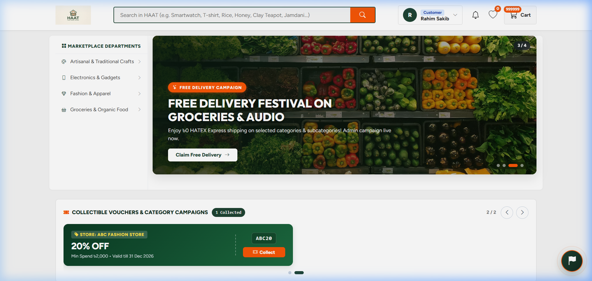
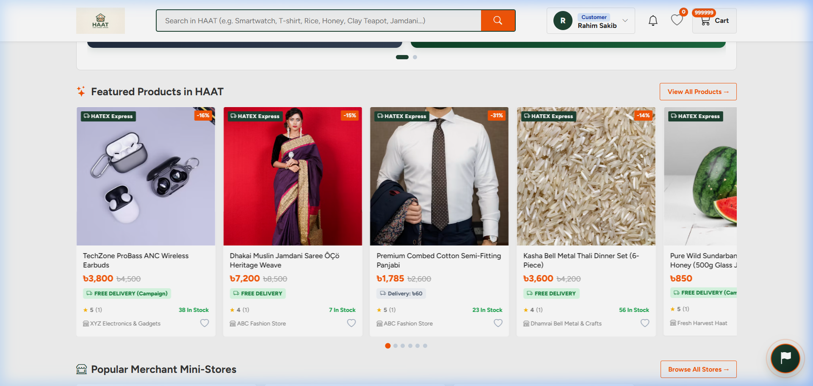
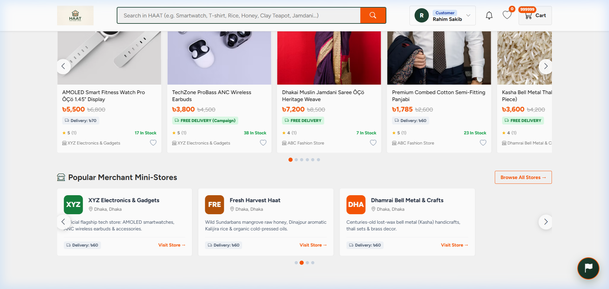
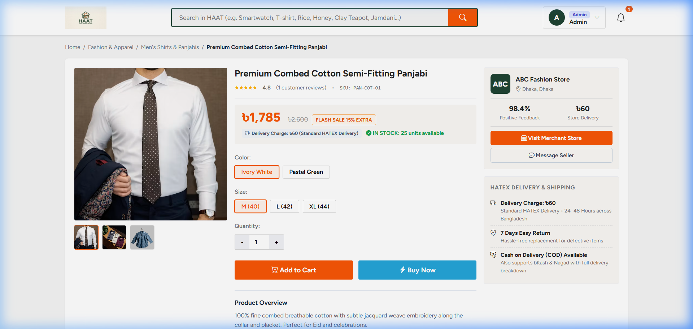
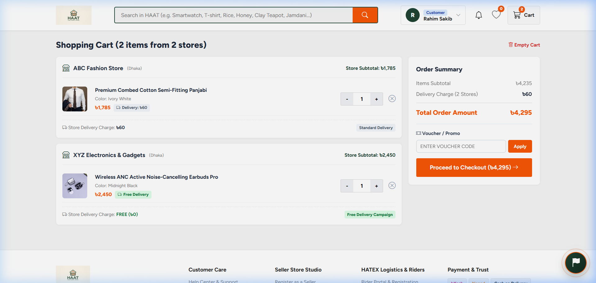
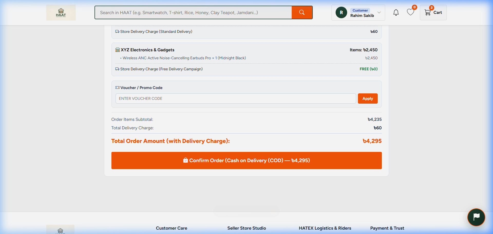
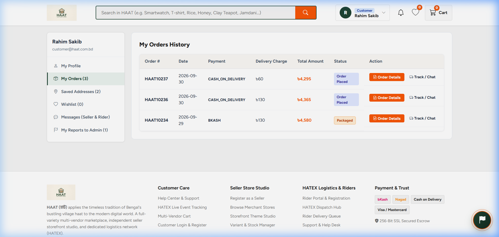

# 🌾 HAAT! — Global • Regional • Artisanal
### *Next-Generation Multi-Vendor Marketplace & HATEX Logistics Platform*

[](https://www.php.net/)
[](https://www.mysql.com/)
[](https://developer.mozilla.org/en-US/docs/Web/JavaScript)
[](#system-architecture)
[](#hatex-logistics-engine)
[](LICENSE)

---

## 📖 Overview

**HAAT!** (হাট) is a full-featured, production-ready multi-vendor e-commerce ecosystem designed to connect regional Bangladeshi heritage artisans, organic agricultural producers, and national consumer brands with global and urban shoppers. 

Built with clean, vanilla web technologies and powered by a high-throughput PHP 8+ PDO REST API with MySQL, HAAT! combines rich UI aesthetics, auto-sliding carousels with smooth micro-interactions, complete multi-vendor store administration, and the proprietary **HATEX Logistics & Rider Tracking Engine**.

---

## 📸 Visual Showcase & Screen Walkthrough

### 1. Modern Hero & Live Promotional Hub
Clean navigation bar, category megamenu flyout, live promotional banner carousel, and regional highlights.


---

### 2. Auto-Sliding Featured Products Carousel
Smooth continuous auto-advancing cards displaying 4.5 items at a time, high-definition product photography, rating stars, price badges, and invisible navigation arrows that reveal smoothly on cursor hover.


---

### 3. Artisanal Stores & Multi-Vendor Hub
Artisan showcase carousel (Dhakai Muslin Jamdani, Dhamrai Bell Metal, Sundarbans Pure Honey, TechZone) featuring certified badges and store profiles.


---

### 4. Categorized Catalog & Deep Filtering
Dynamic category browsing with multi-faceted filtering by division, district, price range, and product tags.


---

### 5. Product Specification & Artisan Narrative
Detailed product showcase with gallery previews, variant selection, artisan craft story, stock availability, and verified buyer reviews.


---

### 6. Interactive Shopping Cart & Order Staging
Instant quantity modifiers, localized delivery calculation, promo code inputs, and real-time total summary.


---

### 7. Multi-Step Checkout & Payment Options
Comprehensive delivery address selection, division & district dropdowns, multiple payment gateways (bKash, Nagad, Cash on Delivery, Cards), and order finalization.


---

### 8. Role-Based Authentication & Registration
Multi-portal gateway supporting Customers, Multi-Vendor Sellers, HATEX Hub Dispatchers, and Delivery Riders.
| Login Portal | Registration Portal |
|:---:|:---:|
|  |  |

---

### 9. Account Dashboard & Real-Time HATEX Tracking
Customer portal displaying active order status, waybill IDs, delivery rider assignment, order history, and saved addresses.


---

## 🌟 Key Platform Features

- **Multi-Vendor Ecosystem**: Independent vendor stores with distinct profiles, custom slugs, geolocation coordinates, and dedicated product inventory.
- **HATEX Logistics Engine**: Built-in parcel dispatch system linking orders directly to dedicated riders with real-time waypoint status tracking (`pending` → `assigned` → `in_transit` → `delivered`).
- **Smart Sliding Carousels**:
  - Auto-advances smoothly across products (3.5s) and stores (4.2s).
  - Clean visual design: navigation arrows are completely invisible by default and gently fade in upon hover.
  - Automatic pause on hover to allow detailed inspection of cards.
- **RESTful API Architecture**: Modular, lightweight PHP endpoints utilizing PDO prepared statements for high security against SQL injection.
- **Transparent Data Synchronization**: Dual-layer architecture (`api-bridge.js`) allowing reactive frontend rendering while synchronizing every modification directly with MySQL.
- **Comprehensive Promotion System**: Percentage and fixed-amount coupon engine (`HAAT100`, `TECH10`, `FASHION15`, `HONEY50`) with minimum spend and validity checks.

---

## 🏗️ System Architecture

```text
┌────────────────────────────────────────────────────────┐
│             HAAT! Frontend Application                 │
│      (Single Page Application · HTML5 · CSS3 · ES6)    │
└──────────────────────────┬─────────────────────────────┘
                           │ Dynamic Event Listeners & State
┌──────────────────────────▼─────────────────────────────┐
│                 api-bridge.js (v2.1)                   │
│   • Auto-Sliding Carousels (Products & Stores)         │
│   • High-Definition Image Pipeline & Fallbacks         │
│   • Asynchronous REST API Fetch Wrapper                │
└──────────────────────────┬─────────────────────────────┘
                           │ JSON via HTTP (GET / POST / PUT)
┌──────────────────────────▼─────────────────────────────┐
│                   PHP 8 REST Backend                   │
│         (/api/products.php · /api/orders.php · ...)    │
└──────────────────────────┬─────────────────────────────┘
                           │ PDO Prepared Statements
┌──────────────────────────▼─────────────────────────────┐
│                 MySQL Relational DB                    │
│           (haat.sql · 21 Relational Tables)            │
└────────────────────────────────────────────────────────┘
```

---

## 🗄️ Database Schema & Entities

The database structure is defined in [`haat.sql`](haat.sql) and preloaded with sample data in [`seed.sql`](seed.sql).

### Core Tables
| Table | Description |
|---|---|
| `users` | User credentials, roles (`customer`, `seller`, `admin`, `logistics`), and status |
| `stores` | Multi-vendor store listings, coordinates, division, verification badges |
| `products` | Product catalog, pricing, sale prices, stock, ratings, and subcategories |
| `categories` & `subcategories` | Hierarchical taxonomy (Fashion, Tech, Organics, Brass & Bell Metal) |
| `orders` & `order_items` | Master order records, item snapshots, subtotal, and tax computations |
| `seller_orders` | Sub-orders routed to individual sellers for multi-store fulfillment |
| `delivery_tracking` | HATEX parcel waybills, checkpoints, and rider telemetry |
| `riders` | Fleet delivery personnel profiles and status |
| `coupons` | Promo codes, discount types, validity, and usage limits |
| `cart` & `wishlists` | Persistent user shopping carts and favorited items |
| `messages` & `notifications` | In-app messaging and transactional system alerts |

---

## 🚀 Quick Start & Installation

### Prerequisites
- [XAMPP](https://www.apachefriends.org/) (Apache + MySQL with PHP 8.0+)
- Web Browser (Chrome, Edge, Firefox, Brave)
- Git

### Step 1: Clone the Repository
Clone the project into your local XAMPP `htdocs` directory:
```bash
cd C:/xampp/htdocs/   # or E:/Xaamp/htdocs/ depending on your drive
git clone https://github.com/MdShazzadhossenshad17/Haat.git "HAAT!"
cd "HAAT!"
```

### Step 2: Start Apache & MySQL
Open the **XAMPP Control Panel** and start both **Apache** and **MySQL** modules.

### Step 3: Import the Database
1. Open phpMyAdmin at [http://localhost/phpmyadmin](http://localhost/phpmyadmin).
2. Click **New** and create a database named `haat` with collation `utf8mb4_unicode_ci`.
3. Select the `haat` database, go to the **Import** tab:
   - Import [`haat.sql`](haat.sql) (creates all tables and constraints).
   - Import [`seed.sql`](seed.sql) (populates demo accounts, stores, products, and orders).

*Alternatively, import via Command Line:*
```bash
mysql -u root -p haat < haat.sql
mysql -u root -p haat < seed.sql
```

### Step 4: Launch the Application
Open your web browser and navigate to:
```
http://localhost/HAAT!/
```

---

## 🔑 Demo Account Credentials

All pre-seeded demo accounts share the password: **`haat2026`**

| Role | Email Address | Password | Permissions & Capabilities |
|---|---|---|---|
| **Platform Admin** | `admin@haat.com.bd` | `haat2026` | Full platform control, store approvals, coupons, logs |
| **Customer** | `customer@haat.com.bd` | `haat2026` | Shopping, cart, checkout, parcel tracking, reviews |
| **Seller (Fashion)** | `seller@abc-fashion.com` | `haat2026` | ABC Fashion Store inventory, product catalog, orders |
| **Seller (Gadgets)** | `seller@xyz-electronics.com` | `haat2026` | XYZ Electronics & Gadgets management |
| **Seller (Artisan)** | `seller@dhamrai-crafts.com` | `haat2026` | Dhamrai Bell Metal crafts catalog and fulfillment |
| **Seller (Organic)** | `seller@fresh-harvest.com` | `haat2026` | Fresh Harvest Haat organic food & honey orders |
| **HATEX Logistics** | `logistics@hatex.com.bd` | `haat2026` | Central dispatch, parcel routing, rider assignment |
| **HATEX Rider** | `tareq@hatex.com.bd` | `haat2026` | Mobile delivery queue, status updates, delivery confirm |

---

## 📡 API Reference Summary

All endpoints return JSON responses with standard HTTP status codes (`200 OK`, `201 Created`, `400 Bad Request`, `401 Unauthorized`, `404 Not Found`).

| Endpoint | Method | Description |
|---|---|---|
| `/api/auth.php?action=login` | `POST` | Authenticates user session |
| `/api/auth.php?action=register` | `POST` | Registers a new customer or vendor |
| `/api/auth.php?action=logout` | `POST` | Terminates active session |
| `/api/products.php` | `GET` | Fetches filtered products with pagination |
| `/api/stores.php` | `GET` | Lists verified vendor stores |
| `/api/categories.php` | `GET` | Returns taxonomy tree with subcategories |
| `/api/cart.php` | `GET / POST / DELETE` | Manages user cart items |
| `/api/orders.php` | `GET / POST` | Retrieves customer orders or places new order |
| `/api/coupons.php` | `GET / POST` | Validates and manages promo codes |
| `/api/delivery.php` | `GET / PUT` | Real-time parcel tracking and updates |

---

## 🛠️ Technology Stack

- **Frontend**: HTML5 Semantic Markup, Vanilla CSS3 (Custom Design System, Glassmorphism, Micro-Animations), Modern JavaScript (ES6+ Modules, Fetch API, Reactive State).
- **Backend**: PHP 8.0+ REST Services, Session Management, Prepared Statements (PDO).
- **Database**: MySQL 8.0 / MariaDB (InnoDB Engine, Foreign Key Integrity, utf8mb4 encoding).
- **Tooling & Environment**: Apache HTTP Server (XAMPP), phpMyAdmin, Git.

---

## 📄 License
This project is open-source and available under the [MIT License](LICENSE).
